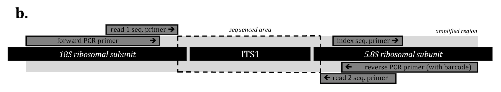

# :koala: NGS Amplicon Data Processing using AMPtk 

We will use [AMPtk](https://amptk.readthedocs.io/en/latest/index.html) to process NGS amplicon data.

We can get this data from a public dataset stored in NCBI. First let's look at the BioProject page [PRJNA379160](https://www.ncbi.nlm.nih.gov/bioproject/PRJNA379160/). This page provides links to the 98 SRA experiments for 16S and ITS amplicon data from Antarctic cryptoendolithic communities.

Although, this study has both 16S and ITS amplicon data, we will perform data processing only on several samples from ITS data.
Data are already available on stajichlab UCR HPCC. We will set up our analysis folder using following instructions.

[Sequencing setup](https://journals.plos.org/plosone/article?id=10.1371/journal.pone.0090234#)


ITS primers for this project contain unique barcode for each sample. We usually submit ~250 samples per illumina miseq run. After sequencing process, the barcodes will be used to split sequences into fastq file for each sample.

## Setting up analysis

First make a data folder (illumina) in bigdata to begin your analysis, change directory to `illumina`, and create symlink to subset of ITS amplicon data.

```bash
cd ~/bigdata/
mkdir -p AMPtk/illumina/
cd AMPtk/illumina/
# create a symlink to the datasets
ln -s /shared/projects/Microbiome/data/Antarctica_Endolithic/ITS/illumina/*8* .
cd ..
```

Now, you should have these 10 data files in your illumina folder and you could verify the previous step by simply use `ls`. 

```bash
ls illumina/

ITS.CC.18A_R1.fastq.gz  ITS.CC.28A_R1.fastq.gz  ITS.CC.8B_R1.fastq.gz
ITS.CC.18A_R2.fastq.gz  ITS.CC.28A_R2.fastq.gz  ITS.CC.8B_R2.fastq.gz
ITS.CC.18B_R1.fastq.gz  ITS.CC.28B_R1.fastq.gz
ITS.CC.18B_R2.fastq.gz  ITS.CC.28B_R2.fastq.gz
```

What does the sequence file look like?
```bash
zmore illumina/ITS.CC.18A_R1.fastq.gz | head

@ITS.CC.18A_3 M02457:94:000000000-AMC54:1:1102:9850:1616 1:N:0:1 orig_bc=CTAGTTTTACCA new_bc=CTAGATTTGCCA bc_diffs=2
GTAGGTGAACCTGCGGAAGGATCATTACTGAGAGACGGGCTTTTCTCCCCCCCTCTCTTCTCCCCTCTCTTCTTTACCCTCTTTCTTTCTCCCTTTTTTGCTTTTTCCCTCCCGGTTCTCTTCCCCGCCTTCTCCCCCTCTCCCCTCCCCTGCTCGCCTATCTCCCTTTCAACTCTCTTCTTATTTTCTTTTTTCCTTCCTCTCCCTTTCTACACTTTTTCATTTCTTATTTTTTTCTTCTTTTCTCTTTTTTCTTCCCTCCCTCTATATTTTCTCTTCTCTTTTTCCTTCTTTTTCTTGT
+
-868@CC,,CDE-FF>++7;8CF8FF9-C9,,,,,,-,++8,,6,6C,,8@+++,,:CEE9,CC,C,,,,,<C,,,:9C,,C<<,C9E,6,,,,,,,:++,,<,9?,5,,48++++++:,,5<,,,+6+++,5,:38+3+,,,,+6@+++>+,@B++@++,,,77@<A,,,,,36,,,33,,,,,3,,,7,661,,,,,,,,,,,,,,,,2,,,,,61,,,,+++++++++3++*1+++2;+2++312+:++)(++*****/********0*/0*)*+*.-/.):***)))1)))).66).
```

```bash
zmore illumina/ITS.CC.18B_R1.fastq.gz | head

@ITS.CC.18B_247 M02457:94:000000000-AMC54:1:1102:9323:1746 1:N:0:1 orig_bc=TAAGGTAAGGTG new_bc=TAAGGTAAGGTG bc_diffs=0
GTAGGTGAACCTGCGGAAGGATCATTACTGAGAGACGGGGTCTTATCGGCCCCACTCTTCACCCATGTCTACTATACCCTGTTGCTTTGGCGGGCCTTCGGGTCTTACCACCCGGGGCTGGTCGGGGCCTTATGCCCCTCGCTCAGCGAGTGCTCGCCAATGACCCTGTCAACTCTGTTCTTAGTGTCCTCTGAGCAACCACACAATAGGTAAAACTTTCAACAACGGATCTCTTGGTTCTGTCATCGATGTAGAACGCAGCCGTCAGGTAAGTTGATCTCTTATGCCTTCTTTTGCTTGT
+
BC<CCFGFFFFFFGGGD@FGGGGDGGFGGGCGC8,CCC7>FFGFEGGC7FFGG>CFFGFFAEFECFCFFGFEGAFCCCFGCFG<EFGGGDFC7C>FCGG++@ECFFFGF9FFE@+=+@FC:FFE7FC@FGGGGFFFFFFG*@:<3>D:*>>:CEFCCECEC:,2?FG,BC;9CFCFDFFEFG9,?,C?CFEG7+22++<BCC*8**;,2+<++++<CFG?7+<**2***:C:<9C>+<::C++:*9:**:**06++1971:*;8E)/*7>*96*2)0<*66*6):*0:).,9)).6?FA5.
```

## AMPtk data processing steps

I created a bash script containing all the general steps from processing Illumina reads to generating OTU table and assigning taxonomy. We'll call this pipeline script `01_AMPtk_ITS.sh`. We'll practice similar set up as we've have done before by keeping all the script in `pipeline` folder and log files in `logs` folder.

```bash
#create pipeline folder for scripts and logs folder for log files
mkdir -p pipeline/ logs/
```

You should now check your `AMPtk` folder to make sure that you have these folders. Once, we have all the data and folders, we can begin STEP1.

```bash
ls -F

illumina/ logs/ pipeline/
```

### STEP 1. Pre-processing 

There are several different file format that could be generated from Illumina Miseq sequencing (or sequencing centers). We'll focus on demultiplexed PE reads in whcih all the sequences were splited into separated fastq files for each samples. The general workflow for Illumina demultiplexed PE reads is:

- [Merge PE reads](https://www.drive5.com/usearch/manual10/merge_pair.html) (use USEARCH or VSEARCH) 
- filter reads that are phiX (USEARCH)
- find forward and reverse primers (pay attention to --require_primer argument)
- remove (trim) primer sequences
- if sequence is longer than --trim_len, truncate sequence


[Merged PE reads](https://www.drive5.com/usearch/manual10/merge_pair.html)

You can use `nano` editor to simply create `01_AMPtk_ITS.sh` script by copyign following command to `nano` and save the sceript in `pipeline` folder.

```bash
nano pipeline/01_AMPtk_ITS.sh
```

The beginnings of this script are going to be listed here and then I will provide the entire [script here](need to update this).

```bash
#!/usr/bin/bash
#SBATCH -p short -N 1 -n 8 --mem 8gb --out logs/AMPtk_ITS.%a.log

CPU=$SLURM_CPUS_ON_NODE

if [ ! $CPU ]; then
 CPU=2
fi

#AMPtk needs to be loaded in miniconda2 for UCR HPCC
#We'll need to unload miniconda3 and load miniconda2 before load AMPtk
module unload miniconda3
module load miniconda2
module load amptk/1.4.0

#Set up basename for all the output that will be generated
BASE=AMPtkITS

#Chnage this to match your data folder name
INPUT=illumina

#Pre-preocessing steps will use `amptk illumia` command for demultiplexed PE reads
if [ ! -f $BASE.demux.fq.gz ]; then
 amptk illumina -i $INPUT --merge_method vsearch -f ITS1-F -r ITS2 --require_primer off -o $BASE --usearch usearch9 --cpus $CPU --rescue_forward on --primer_mismatch 2 -l 250
fi
```

### STEP 2. Clustering

[Clustering](https://www.drive5.com/usearch/manual/uparseotu_algo.html)

This step will cluster sequences into Operational Taxonomy Unit (OTU), then generate representative OTU sequences and OTU table. OTU generation pipelines in AMPtk uses UPARSE clustering with 97% similarity (this can be changed).

```bash
if [ ! -f $BASE.otu_table.txt ];  then
 amptk cluster -i $BASE.demux.fq.gz -o $BASE --uchime_ref ITS --usearch usearch9 --map_filtered -e 0.9 --cpus 8
fi
```


Checking OTU table
```bash
#OTU ID	ITS.CC.18A	ITS.CC.18B	ITS.CC.28A	ITS.CC.28B	ITS.CC.8B
OTU1	2301	2871	353140	11034	14929
OTU10	0	2580	2	0	0
OTU100	0	3	0	0	0
OTU101	0	0	6	0	0
OTU102	1	0	3	0	1
OTU104	1	0	1	0	0
OTU105	0	2	33	0	0
OTU106	1	0	5	0	1
OTU107	1	0	5	1	1
```

### STEP 3. Taxonomy Assignment
This step will assign taxonomy to each OTU sequence and add taxonomy to OTU table. This command will generate taxnomy based on the ITS database.

```bash
if [ ! -f $BASE.otu_table.taxonomy.txt ]; then
 amptk taxonomy -f $BASE.cluster.otus.fa -i $BASE.otu_table.txt -d ITS
fi
```

When the taxonomy assignment is completed, we can check the taxonmy file which will be `AMPtkITS.cluster.taxonomy.txt`

```bash
head -5 AMPtkITS.cluster.taxonomy.txt

#OTUID	taxonomy	USEARCH	SINTAX	UTAX
OTU1	GS|100.0|GU074436|SH1524733.08FU;k:Fungi,p:Ascomycota,c:Lecanoromycetes,o:Lecideales,f:Lecideaceae,g:Lecidea,s:Lecidea cancriformis	k:Fungi,p:Ascomycota,c:Lecanoromycetes,o:Lecideales,f:Lecideaceae,g:Lecidea,s:Lecidea cancriformis	k:Fungi,p:Ascomycota,c:Lecanoromycetes,o:Lecideales,f:Lecideaceae,g:Lecidea,s:Lecidea cancriformis	k:Fungi,p:Ascomycota,c:Lecanoromycetes,o:Lecideales,f:Lecideaceae,g:Lecidea
OTU3	US|0.9077|KF823589|SH1564421.08FU;k:Fungi,p:Basidiomycota,c:Tremellomycetes,o:Tremellales	k:Fungi,p:Basidiomycota,c:Tremellomycetes,o:Tremellales,f:Sirobasidiaceae	k:Fungi	k:Fungi,p:Basidiomycota,c:Tremellomycetes,o:Tremellales
OTU4	SS|1.0000|LN810767|SH1614717.08FU;k:Fungi,p:Ascomycota,c:Lecanoromycetes,o:Acarosporales,f:Acarosporaceae	k:Fungi,p:Ascomycota,c:Lecanoromycetes,o:Acarosporales,f:Acarosporaceae,g:Acarospora,s:Acarospora fuscata	k:Fungi,p:Ascomycota,c:Lecanoromycetes,o:Acarosporales,f:Acarosporaceae	k:Fungi,p:Ascomycota,c:Lecanoromycetes,o:Acarosporales,f:Acarosporaceae
OTU5	SS|1.0000|LN881898|NA;k:Fungi,p:Ascomycota,c:Lecanoromycetes,o:Acarosporales,f:Acarosporaceae	k:Fungi	k:Fungi,p:Ascomycota,c:Lecanoromycetes,o:Acarosporales,f:Acarosporaceae	k:Fungi
```


### STEP 4. FUNGuilds Assignment
We can also assign Fungi Funtional Guilds for each taxonomy using [FUNGuilds](https://github.com/UMNFuN/FUNGuild).

```bash
if [ ! -f $BASE.guilds.txt ]; then
 amptk funguild -i $BASE.cluster.otu_table.taxonomy.txt --db fungi -o $BASE
fi
```

Checking `AMPtkITS.guilds.txt` result

```bash
cut -f11 AMPtkITS.guilds.txt | sort | uniq -c

     60 -
      2 Animal Endosymbiont-Animal Pathogen-Endophyte-Plant Pathogen-Undefined Saprotroph
      2 Animal Pathogen-Endophyte-Plant Pathogen-Wood Saprotroph
      1 Animal Pathogen-Fungal Parasite-Undefined Saprotroph
      1 Animal Pathogen-Plant Pathogen-Soil Saprotroph-Undefined Saprotroph
      5 Animal Pathogen-Plant Pathogen-Undefined Saprotroph
      1 Animal Pathogen-Undefined Saprotroph
      1 Dung Saprotroph-Plant Saprotroph
      1 Ectomycorrhizal-Fungal Parasite-Plant Pathogen-Wood Saprotroph
      1 Fungal Parasite-Plant Pathogen-Plant Saprotroph
      7 Fungal Parasite-Undefined Saprotroph
      1 Guild
     15 Lichenized
      2 Plant Pathogen
     10 Undefined Saprotroph
```


### STEP 5. Run 01_AMPtk_ITS.sh

We've learned all four main steps for NGS amplicon data processing. Now, we will add all the steps together and run as a bash script `AMPtk.sh`

```bash
sbatch pipeline/01_AMPtk_ITS.sh
```

We only process 5 samples. AMPtk will take several minutes. When the run is completed, you should generate these files.

```bash 
ls -ltr

total 55296
drwxr-xr-x 2 npomb001 stajichlab     4096 Sep 11 08:44 pipeline
drwxr-xr-x 2 npomb001 stajichlab     4096 Sep 11 08:44 logs
-rw-r--r-- 1 npomb001 stajichlab       28 Sep 11 11:30 AMPtkITS.filenames.txt
drwxr-xr-x 2 npomb001 stajichlab     4096 Sep 11 11:31 AMPtkITS
drwxr-xr-x 2 npomb001 stajichlab     4096 Sep 11 11:31 illumina
-rw-r--r-- 1 npomb001 stajichlab      595 Sep 11 11:31 AMPtkITS.mapping_file.txt
-rw-r--r-- 1 npomb001 stajichlab 51554828 Sep 11 11:32 AMPtkITS.demux.fq.gz
-rw-r--r-- 1 npomb001 stajichlab    15232 Sep 11 11:32 AMPtkITS.amptk-demux.log
-rw-r--r-- 1 npomb001 stajichlab     6841 Sep 11 11:35 AMPtkITS.amptk-cluster.log
-rw-r--r-- 1 npomb001 stajichlab    24994 Sep 11 11:35 AMPtkITS.cluster.otus.fa
-rw-r--r-- 1 npomb001 stajichlab     1948 Sep 11 11:35 AMPtkITS.otu_table.txt
-rw-r--r-- 1 npomb001 stajichlab    12158 Sep 11 11:35 AMPtkITS.cluster.otu_table.taxonomy.txt
-rw-r--r-- 1 npomb001 stajichlab    35195 Sep 11 11:35 AMPtkITS.cluster.otus.taxonomy.fa
-rw-r--r-- 1 npomb001 stajichlab    27614 Sep 11 11:35 AMPtkITS.cluster.taxonomy.txt
-rw-r--r-- 1 npomb001 stajichlab     3474 Sep 11 11:35 AMPtkITS.cluster.tree.phy
-rw-r--r-- 1 npomb001 stajichlab    17638 Sep 11 11:35 AMPtkITS.cluster.biom
-rw-r--r-- 1 npomb001 stajichlab     5384 Sep 11 11:35 AMPtkITS.cluster.amptk-taxonomy.log
-rw-r--r-- 1 npomb001 stajichlab    25045 Sep 11 11:35 AMPtkITS.guilds.txt

```


