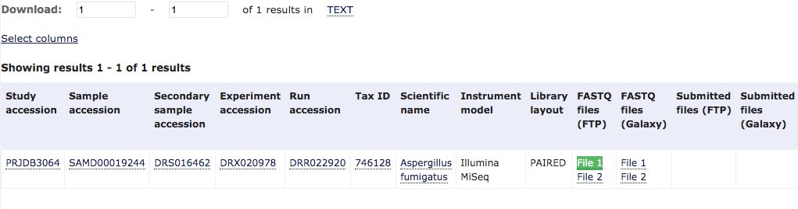

# Genome Assembly

We will perform a genome assembly for an _Aspergillus fumigatus_ strain which I've previously assembly using public data.

We will get this data from a public dataset stored in NCBI. First let's look at the BioProject page [PRJDB3064](http://ncbi.nlm.nih.gov/bioproject/PRJDB3064). This page provides links to the 8 patient isolated cultures.

One strain we will focus on is stored as two SRA datasets [DRR022919](https://www.ncbi.nlm.nih.gov/Traces/study/?acc=DRR022919) [DRR022920](https://www.ncbi.nlm.nih.gov/Traces/study/?acc=DRR022920).

This study has two files for the same strain, one only has 268Mb of data (DRR022919), the other has 1.3Gb (DRR022920). It is probably sufficient to run the assembly process with only the DRR022920 file to keep things simple but we can discuss how you would approach this if you had 2 files.

# Obtaining the sequence data

We are going to download the data using the SRA toolkit and also direct download from EBI of already formatted FASTQ files. The EBI site takes a little longer to download from but provides already formatted FASTQ. The NCBI site is faster to download from usually but you still have to convert the download from the .sra format to .fastq which can take time.  Below I show you several

If you running this NOT on the biocluster you can download it using curl or aspera from the EBI. You can also take advantage of the fact that I have already downloaded the data into the folder `/bigdata/stajichlab/shared/tmp/Afum` so you can simply copy of symlink to this folder.

## Downloading with Curl

`curl`, `wget`, or `lftp` will all allow you run command line download from EBI using a slow but usually accessible method on most computers. By going to the EBI website you can search for the SRA accession number and then bring up this page for the record [DRR022920 at EBI](https://www.ebi.ac.uk/ena/data/view/DRR022920&display=html) and [DRR022919 at EBI](https://www.ebi.ac.uk/ena/data/view/DRR022919&display=html).

Lots more information on downloading at the [EBI read download site](https://www.ebi.ac.uk/ena/browse/read-download).



This site has links to FASTQ files you can use to download. I would probably not do this unless the example further below don't work for you since this will be the slowest download speed. Also for simplicity during the tutorial I have made a copy of all the data so these more like examples when you start to define the data you want to process.

```bash
curl -O ftp://ftp.sra.ebi.ac.uk/vol1/fastq/DRR022/DRR022920/DRR022920_1.fastq.gz
curl -O ftp://ftp.sra.ebi.ac.uk/vol1/fastq/DRR022/DRR022920/DRR022920_2.fastq.gz
curl -O ftp://ftp.sra.ebi.ac.uk/vol1/fastq/DRR022/DRR022919/DRR022919_1.fastq.gz
curl -O ftp://ftp.sra.ebi.ac.uk/vol1/fastq/DRR022/DRR022919/DRR022919_2.fastq.gz
```

## Download with aspera

[Aspera](https://downloads.asperasoft.com/connect2/) a very fast download interface. You can access it on the HPCC using
```BASH
module load aspera
ascp -QT -l 1000m -P33001 -i $ASPERAKEY era-fasp@fasp.sra.ebi.ac.uk:/vol1/fastq/DRR022/DRR022920/DRR022919_1.fastq.gz .
ascp -QT -l 1000m -P33001 -i $ASPERAKEY era-fasp@fasp.sra.ebi.ac.uk:/vol1/fastq/DRR022/DRR022920/DRR022919_2.fastq.gz .
ascp -QT -l 1000m -P33001 -i $ASPERAKEY era-fasp@fasp.sra.ebi.ac.uk:/vol1/fastq/DRR022/DRR022920/DRR022920_1.fastq.gz .
ascp -QT -l 1000m -P33001 -i $ASPERAKEY era-fasp@fasp.sra.ebi.ac.uk:/vol1/fastq/DRR022/DRR022920/DRR022920_2.fastq.gz .
```
This requires knowing ahead of time the path to the folder at EBI to run the aspera download which I determined from the FASTQ FTP download.

However there is a nice Perl script I use which simply requires specifying a file with SRA accessions and will download for you using either FTP or aspera.

You can download it [from here](https://github.com/gerthmicha/perlscripts/blob/master/sra_download.pl). It is also available on the biocluster in `/bigdata/stajichlab/shared/bin/sra_download.pl`. To run it make a file with one accession per line, I like to call it `sra.txt`. Here is an example
```
DRR022919
DRR022920
```
To run the download script you can run it as follows on HPCC.

```bash
module load aspera
/bigdata/stajichlab/shared/bin/sra_download.pl --ascp --id $ASPERAKEY sra.txt
```

# Setting up analysis

To instead symlink to these data I would suggest focusing only on the DRR022920 accessions.

First make a folder in bigdata to begin your analysis.

```bash
cd ~/bigdata/
mkdir -p assembly/input
cd assembly/input
# create a symlink to the datasets
ln -s /bigdata/stajichlab/shared/tmp/Afum/DRR022920/* .
ln -s /bigdata/stajichlab/shared/tmp/Afum/DRR022919/* .
cd ..
```

Because we want to support a general way of running assemblies across any dataset, we will setup this folder and system in a way that will enable running across multiple isolates.  To do this we need a file that keeps track of a few bits of data about each dataset.  One assumption for the time being is that there is ONE set of paired sequence files for a given isolate you want to assemble. It is possible to recode this so that it can be smarter about taking multiple files OR you can do the really simple things and combine data files before running the analysis steps so that there is only one file per isolate.

To start out we need a data file that we can use in the system to specify information about the dataset. I like to call my file samples.csv but you can vary from that easily as you will see. I called it .csv because we will use commas to separate the data in the file, but it is also possible to do this with tab or even white space as the separator. We will start this off with a samples.csv which has 3 columns, the FATQ READS file basename, the sample/strain name, the expected phyla this is from for some of the optional data cleaning steps. The first is the name of the READ file - in our case that will SRA accession number `DRR022920`. Based on the Biosample record at NCBI or EBI this sample is given the strain designate 'IFM 59356-1'. Because white spaces are often issues I like to change all white spaces to `_` for ease. So we will use the name 'IFM_59356-1'. So our samples file will have for now, one line:
```
DRR022920,IFM_59356-1,Ascomycota
```

I've created a package I call AAFTF to simplify running all the steps. I'll walk through the parts of the script which relate to each of the pipeline steps. We'll call this job script `01_AAFTF.sh` as I like to number the scripts so I can remember what order they should run in. I typically make a folder called `pipeline` where I keep this script. I also store all the log files that run during an analysis in a folder call `logs` to keep the folder from getting cluttered.

```bash
mkdir -p assembly/pipeline assembly/logs
```
The beginnings of this script are going to be listed here and then I will provide the entire script.

## Data filtering

Generally it is a good idea to do some data filtering to remove contaminating sequence reads like PhiX and vector sequences.


## AAFTF
